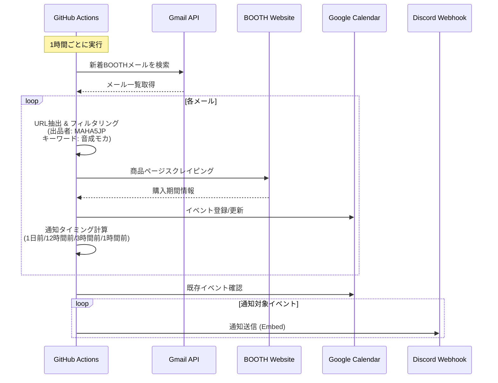

# LifeManageLLMAction

BOOTHの新着商品を自動監視し、購入期間をGoogleカレンダーに登録、終了前にDiscord通知するシステムです。

## 📋 概要

このプロジェクトは、BOOTH出品者の新着商品情報をGmailから取得し、購入期間をGoogleカレンダーに自動登録します。購入期限が近づくとDiscord Webhookで通知を送信します。

### 主な機能

- 📧 Gmailから新着BOOTH商品メールを自動取得
- 🔍 出品者名・キーワードによるフィルタリング
- 🌐 Playwrightによる商品ページスクレイピング
- 📅 Googleカレンダーへの購入期間自動登録
- 🔔 Discord Webhookによる期限通知（1日前/12時間前/3時間前/1時間前）
- ⏰ GitHub Actionsで1時間ごとに自動実行

## 🏗️ システムアーキテクチャ



## 🛠️ 技術スタック

- **言語**: TypeScript
- **ランタイム**: Node.js 20
- **パッケージマネージャ**: npm
- **モノレポ管理**: [moonrepo](https://moonrepo.dev/)
- **バージョン管理**: [proto](https://moonrepo.dev/proto)
- **テストフレームワーク**: Vitest
- **ブラウザ自動化**: Playwright
- **CI/CD**: GitHub Actions
- **ローカルテスト**: [act](https://github.com/nektos/act)

### 外部API

- Gmail API
- Google Calendar API
- Discord Webhook

## 📁 プロジェクト構成

```
LifeManageLLMAction/
├── .github/
│   └── workflows/
│       ├── booth-monitor.yml         # 本番用ワークフロー定義
│       └── booth-monitor-test.yml    # テスト用ワークフロー
├── packages/
│   └── booth-monitor/
│       ├── src/
│       │   ├── main.ts               # エントリーポイント
│       │   ├── gmail/                # Gmail API操作
│       │   ├── booth/                # BOOTHスクレイピング
│       │   ├── calendar/             # Google Calendar操作
│       │   ├── discord/              # Discord Webhook
│       │   └── notification/         # 通知スケジューラ
│       ├── tests/
│       │   ├── unit/                 # 単体テスト
│       │   └── integration/          # 統合テスト
│       ├── moon.yml
│       ├── package.json
│       ├── tsconfig.json
│       └── vitest.config.ts
├── docs/
│   ├── ACT_TESTING.md                # actテストガイド
│   └── ENVIRONMENT_VARIABLES.md      # 環境変数設定ガイド
├── .prototools                       # protoバージョン管理
├── .moon/                            # moonrepo設定
├── package.json                      # ルートpackage.json
└── tsconfig.json                     # ルートTypeScript設定
```

## 🚀 セットアップ

### 前提条件

- Node.js 20以上
- [proto](https://moonrepo.dev/docs/proto/install) インストール済み
- Docker Desktop (actテスト用)

### 1. リポジトリクローン

```bash
git clone https://github.com/YOUR_USERNAME/LifeManageLLMAction.git
cd LifeManageLLMAction
```

### 2. 依存関係のインストール

```bash
# protoで指定バージョンのツールをインストール
proto use

# 依存関係インストール
npm install
```

### 3. API認証情報の設定

詳細は[実装計画書](/.gemini/antigravity/brain/650f80cd-4c6f-4141-8bc4-7920afd47025/implementation_plan.md)および[環境変数ガイド](docs/ENVIRONMENT_VARIABLES.md)を参照してください。

#### 必要なシークレット

GitHub Secretsに以下を設定:

- `GOOGLE_CLIENT_ID`: OAuth 2.0 Client ID
- `GOOGLE_CLIENT_SECRET`: OAuth 2.0 Client Secret
- `GOOGLE_REFRESH_TOKEN`: OAuth 2.0 Refresh Token
- `GOOGLE_CALENDAR_ID`: カレンダーID
- `DISCORD_WEBHOOK_URL`: Discord Webhook URL

#### 環境変数

GitHub Variables に以下を設定:

- `BOOTH_SHOP_NAME`: 監視対象出品者名（例: `MAHA5JP`）
- `BOOTH_KEYWORDS`: 監視キーワード（例: `音成モカ`）

## 🧪 開発ワークフロー

### テスト駆動開発 (TDD)

このプロジェクトはTDD方式で開発します。

```bash
# テスト実行
moon run booth-monitor:test

# ウォッチモード
moon run booth-monitor:test:watch

# カバレッジレポート
moon run booth-monitor:test:coverage
```

### ビルド

```bash
# booth-monitorパッケージのビルド
moon run booth-monitor:build
```

### リント

```bash
# ESLint実行
moon run booth-monitor:lint
```

## 🐳 GitHub Actionsのローカルテスト

`act`を使用してGitHub Actionsワークフローをローカルでテストできます。

### クイックスタート

```bash
# Dockerを起動後
act workflow_dispatch \
  --container-architecture linux/amd64 \
  -W .github/workflows/booth-monitor-test.yml \
  --secret-file .secrets.act \
  --var BOOTH_SHOP_NAME=MAHA5JP \
  --var BOOTH_KEYWORDS=音成モカ
```

詳細は[docs/ACT_TESTING.md](docs/ACT_TESTING.md)を参照してください。

## 📝 開発状況

現在の実装状況は[タスク管理](/.gemini/antigravity/brain/650f80cd-4c6f-4141-8bc4-7920afd47025/task.md)を参照してください。

### Phase 1: プロジェクト初期化 ✅
- moonrepo/proto設定
- TypeScriptプロジェクト構成
- 依存関係インストール
- 実装計画書作成

### Phase 2: コアモジュール実装 ✅
- Gmail API連携モジュール
- BOOTHスクレイピングモジュール
- フィルタリングモジュール
- Google Calendar連携モジュール
- Discord Webhook連携モジュール
- 通知スケジューラモジュール

### Phase 3: メインロジック統合 ✅
- メインエントリーポイント実装
- 統合ロジック
- エラーハンドリング・ログ出力

### Phase 4: GitHub Actions設定 ✅
- ワークフロー定義 (手動YAML)
- スケジュール設定
- 環境変数ガイド

### Phase 5: 動作検証 🚧
- 自動テスト (ALL PASS)
- ローカル動作確認手順整備
- 本番動作確認

## 📚 ドキュメント

- [実装計画書](/.gemini/antigravity/brain/650f80cd-4c6f-4141-8bc4-7920afd47025/implementation_plan.md)
- [タスク管理](/.gemini/antigravity/brain/650f80cd-4c6f-4141-8bc4-7920afd47025/task.md)
- [検証手順書](/.gemini/antigravity/brain/650f80cd-4c6f-4141-8bc4-7920afd47025/walkthrough.md)
- [actテストガイド](docs/ACT_TESTING.md)
- [環境変数ガイド](docs/ENVIRONMENT_VARIABLES.md)

## 🤝 コントリビューション

このプロジェクトはTDD、Conventional Commits、moonrepoを採用しています。

## 📄 ライセンス

MIT License
