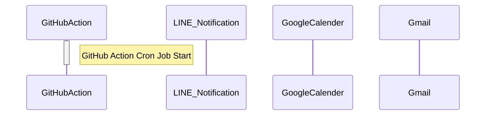

# LifeManageLLMAction
生活管理のために`Claude Code`の`GitHub Action`版を利用します。

## 購入期間登録機能

```mermaid
sequenceDiagram
    participant A as GitHubAction
    participant L as LINE_Notification
    participant GC as GoogleCalender
    participant GM as Gmail

    activate A
    note right of A: GitHub Action Cron Job Start 
    
    deactivate A
```

